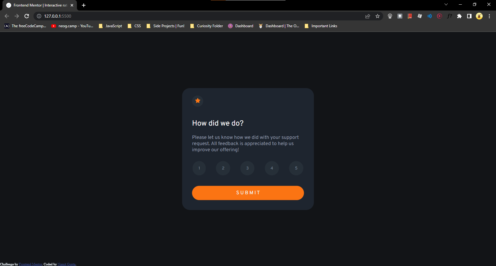

# Frontend Mentor - Interactive rating component solution

This is a solution to the [Interactive rating component challenge on Frontend Mentor](https://www.frontendmentor.io/challenges/interactive-rating-component-koxpeBUmI). 

## Table of contents

- [Overview](#overview)
  - [The challenge](#the-challenge)
  - [Screenshot](#screenshot)
- [My process](#my-process)
  - [Built with](#built-with)
  - [What I learned](#what-i-learned)
  - [Useful resources](#useful-resources)
- [Author](#author)

## Overview

### The challenge

Users should be able to:

- View the optimal layout for the app depending on their device's screen size
- See hover states for all interactive elements on the page
- Select and submit a number rating
- See the "Thank you" card state after submitting a rating

### Screenshot

### Links

- Solution URL: [My Solution URL](https://namitcodes.github.io/Interactive-Rating-Component/)

## My process

### Built with

- Semantic HTML5 markup
- CSS custom properties
- Flexbox
- Vanilla JS

### What I learned

I learned and revised a lot of stuff making this challenge. Learning by doing is a true thing and very powerful. My confidence has boosted so much. 
What I learned here is, whenever you get stuck, google stuff, a lot.

### Useful resources

- [Color Picker Tool](https://imagecolorpicker.com/en) - This helped me picking the exact colors from the given design. The color codes given in design resources looked kinda odd.

## Author

- Frontend Mentor - [@NamitCodes](https://www.frontendmentor.io/profile/NamitCodes)
- Twitter - [@EnGeeExists](https://twitter.com/EnGeeExists)
